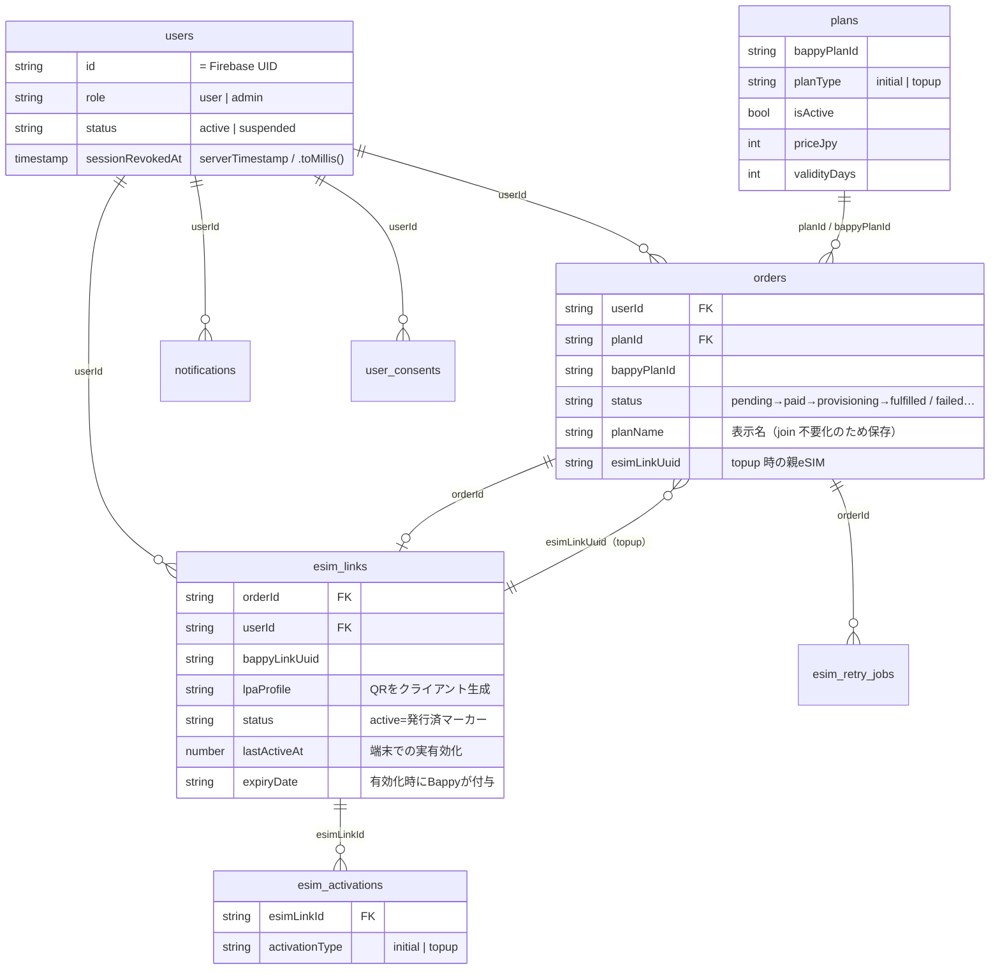

# Firestore スキーマ / リレーション図（yah.mobile）

型の唯一の定義は `shared/types.ts`（`Fs*` インターフェース）。コレクション定義は `functions/src/db.ts` の `collections`。
アクセス制御は `firestore.rules`。日時は原則 epoch millis（`number`）。一部は Firestore `Timestamp`（例: `users.sessionRevokedAt` はクライアントが `serverTimestamp()` で書き、functions が `.toMillis()` で読む）。

---

## コレクション一覧

| コレクション | 型 | doc ID | 主なアクセス |
|---|---|---|---|
| `users` | FsUser | Firebase UID | 本人のみ read。role/status はクライアント変更不可 |
| `plans` | FsPlan | 任意 | 全員 read。write は admin のみ＋サーバー側バリデーション |
| `orders` | FsOrder | 自動 | 本人 read。作成は Functions 専用。本人は `hiddenByUser` のみ更新可 |
| `esim_links` | FsEsimLink | 自動 | 本人 read。作成は Functions 専用 |
| `esim_activations` | FsEsimActivation | 自動 | initial/topup のアクティベーション履歴 |
| `bappy_token_cache` | – | – | Bappy OAuth トークンキャッシュ（Functions 専用） |
| `stripe_events` | FsStripeEvent | Stripe event ID | 冪等性ガード（Functions 専用） |
| `audit_logs` | – | 自動 | 監査ログ |
| `notifications` | FsNotification | 自動 | 本人向け通知。`type` で多言語表示を分岐 |
| `contact_inquiries` | FsContactInquiry | 自動 | お問い合わせ |
| `analytics_events` | – | 自動 | 解析イベント（同意連動） |
| `ai_referrer_logs` | – | 自動 | AI クローラー流入ログ |
| `recommend_logs` | – | 自動 | レコメンド操作ログ |
| `allowed_emails` | FsAllowedEmail | 自動 | 招待制の許可メール |
| `esim_retry_jobs` | FsEsimRetryJob | 自動 | eSIM 発行リトライキュー |
| `incident_logs` | FsIncidentLog | 自動 | インシデント記録 |
| `user_consents` | FsUserConsent | 自動 | 同意履歴（規約/プライバシー/マーケ） |
| `exchange_rates` | FsExchangeRate | currency | 為替レート |
| `promotions` | FsPromotion | code | クーポン/プロモ |
| `system_stats` | FsSystemStats | 固定 | 集計統計 |

---

## リレーション（ER 図）

---

## ステータスの意味（重要な落とし穴）

- **`orders.status`**: `pending`→`paid`→`provisioning`→`fulfilled`（失敗系: `pending_retry`/`failed`/`refunded`/`cancelled`）。
- **`esim_links.status = "active"`** は **「発行済み」マーカー**であり、**端末での実有効化ではない**。
  実有効化の判定は `lastActiveAt != null`、またはデータ消費（`dataRemainingMb < dataTotalMb`）で行う。
  UI 判定は `client/src/components/mypage/esimStatus.ts` の `deriveEsimStatus` に集約。
- **`esim_links.expiryDate`** は未有効化では `null`（有効化時にBappyが付与）。
  未有効化カードは plan の `validityDays` から「Valid for N days · from activation」を表示（嘘の日付を出さない）。

---

## 表示名（planName）の解決

古い注文は `orders.planName` が無い場合がある。UI は `plans`（`isActive==true`）を購読し `bappyPlanId/planId → name` の Map で補完する
（`client/src/components/mypage/useMyPageData.ts` の `resolvedOrders`）。新規注文は作成時に `planName` を保存する。
