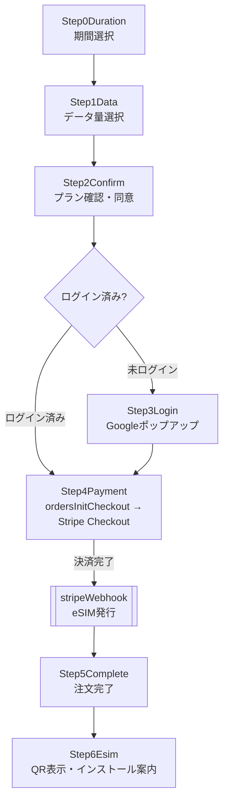

# 画面 / 購入フロー図（yah.mobile）

ルーティングは wouter。i18n の言語プレフィックス（`/{lang}`）を `base` で付与する（en はデフォルトで無印。対応: en / ko / zh-CN / zh-TW / th）。
ルート定義は `client/src/App.tsx`。

---

## ルート一覧

| パス | コンポーネント | 用途 | 認証 |
|---|---|---|---|
| `/` | → `/app` へ Redirect | – | – |
| `/app` | AppPage | ランディング＋購入ドロワー（`#plans` `#faq` `#compatibility` `#contact` アンカー） | 不要 |
| `/login` | LoginPage | ※通常は Google ポップアップ直起動。フォールバック用 | – |
| `/mypage` | MyPage | 注文/eSIM 一覧・通知 | 要ログイン |
| `/mypage/orders/:orderId` | OrderDetailPage | 注文詳細（eSIM QR / ステータス / 期限） | 要ログイン |
| `/mypage/topup/:esimLinkId` | TopupPage | トップアップ購入 | 要ログイン |
| `/admin` `/admin/:tab` | AdminPage | 管理画面（plans/注文/問い合わせ等） | admin のみ |
| `/privacy` `/terms` `/cookie-policy` | 各ポリシー | 法務 | 不要 |
| `/unauthorized` `/404` / その他 | Unauthorized / NotFound | – | – |

`/mypage` `/admin` は `robots.txt` で Disallow（インデックス除外）。

---

## 購入フロー（PurchaseDrawer）

`client/src/components/app/PurchaseDrawer.tsx` ＋ `purchase-drawer/steps/*`。

### バックエンド連携（購入時）
1. `Step4Payment` が Callable **`ordersInitCheckout`** を呼ぶ → `orders(status:pending)` 作成＋Stripe `checkoutUrl` 取得。
2. ユーザーが Stripe で決済 → **`stripeWebhook`**（HTTP）が受信し、Bappy へ eSIM 発行 → `esim_links` 作成、`orders.status` 更新。
3. 発行失敗時は `esim_retry_jobs` に積み、**`esimRetryJob`**（Scheduled）が再試行。30分以上 `provisioning` のままなら **`hungOrderMonitor`** がオーナー通知。
4. `Step6Esim` は `esim_links.lpaProfile` から **クライアント側で QR を生成**（`client/src/components/EsimQr.tsx`、Storage 画像は廃止）。

### トップアップ
`/mypage/topup/:esimLinkId`（TopupPage）→ Callable **`ordersInitTopupCheckout`**（所有者検証）→ Stripe → `stripeWebhook` → `esim_activations(activationType:"topup")`。

---

## マイページの主要表示ロジック

- データ取得: `client/src/components/mypage/useMyPageData.ts`（orders / esim_links / plans / notifications を購読、planName を補完）。
- eSIM ステータス: `esimStatus.ts` の `deriveEsimStatus`（`Ready to Install` / `Active` / `Low Data`(≤10%) / `Expired`）。
- 期限表示: `formatEsimExpiry`（有効化済み=実 `expiryDate`、未有効化=「Valid for N days · from activation」）。
- 通知: `Notifications.tsx`（`type` ごとに i18n。5言語。未知 type は保存済みテキストへフォールバック）。

詳細な API 仕様は [api_functions.md](./api_functions.md)、データ構造は [firestore_schema.md](./firestore_schema.md) を参照。
